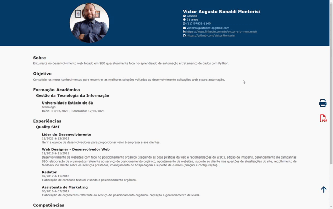

<h1 align="center">Meu Curriculum Vitae | My Curriculum Vitae</h1>

  <a href="#-pt-br">🇧🇷 PT-BR</a>&nbsp;&nbsp;&nbsp;|&nbsp;&nbsp;&nbsp;
  <a href="#-eng">🇺🇸 ENG</a>&nbsp;&nbsp;&nbsp;

  

## 🇧🇷 PT-BR

Página web desenvolvida para exibir as minhas principais informações e experiências profissionais, de maneira simples e eficaz.

## 🚀 Tecnologias

Esse projeto foi desenvolvido com as seguintes tecnologias:

- HTML => Estrutura;
- CSS => Estilo;
- JavaScript => Interatividade;
- PHP => Otimização da estrutura e emprego do conteúdo;
- html2pdf => Biblioteca JS para converter páginas web em documentos PDF;
- Fontawesome => Biblioteca de ícones;
- Git e Github => Versionamento e hospedagem;
- Vercel => Hospedagem.

## 💻 Projeto

Desenvolvida com uma estrutura similar a uma landing page, essa webpage tem o objetivo de apresentar minhas principais informações compondo o meu portfólio.

 
 
 

## 🇺🇸 ENG

Web page developed to display my key information and professional experiences in a simple and effective manner.

## 🚀 Technologies

This project was developed using the following technologies:

- HTML => Structure;
- CSS => Style;
- JavaScript => Interactivity;
- PHP => Optimization of structure and content implementation;
- html2pdf => JavaScript library to convert web pages into PDF documents;
- Fontawesome => Icon library;
- Git and Github => Version control and hosting;
- Vercel => Hosting.

## 💻 Project

Developed with a structure similar to a landing page, this webpage aims to present my key information, comprising my portfolio.